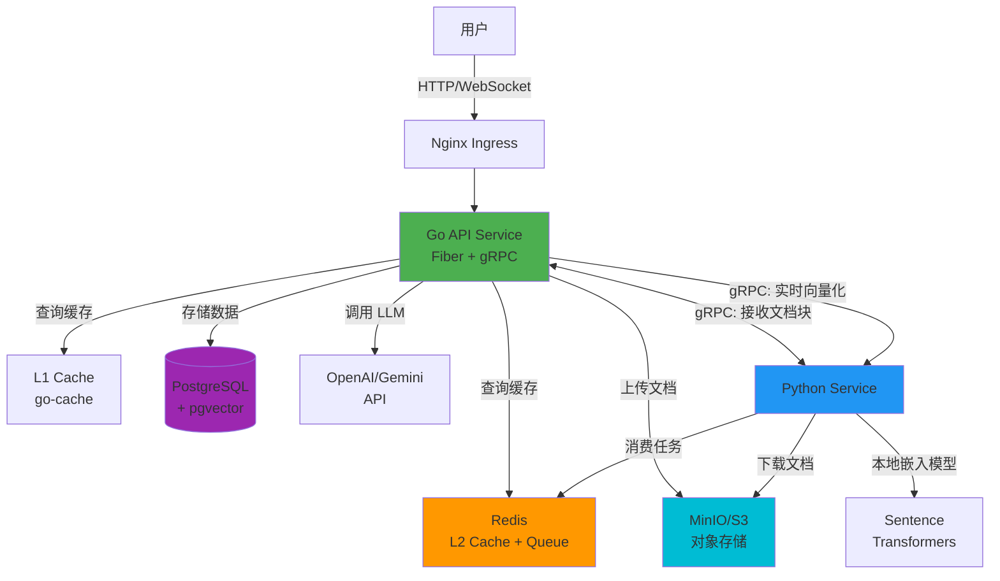
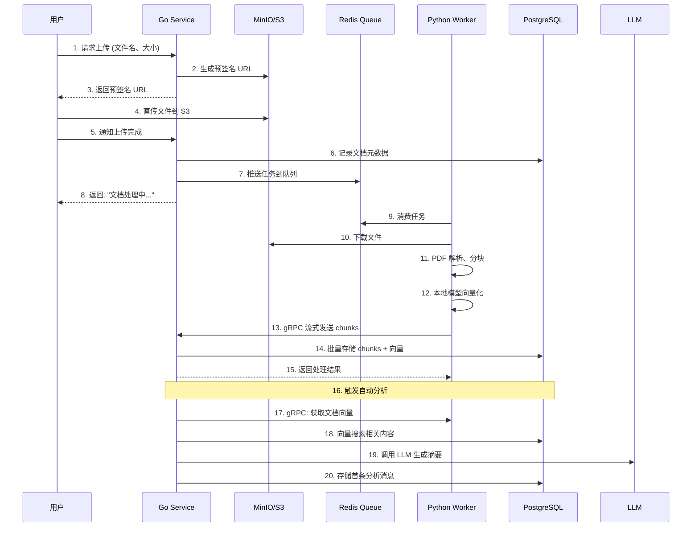
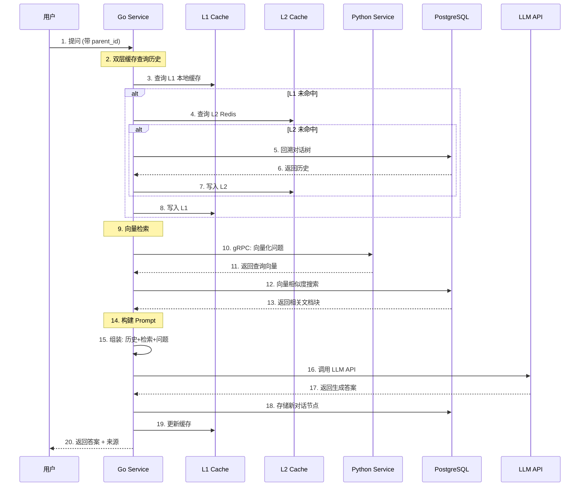

# CogniCore - 智能文档问答系统

<div align="center">

**企业级 RAG (检索增强生成) 平台**

[](https://golang.org/)
[](https://python.org/)
[](LICENSE)

_基于文档知识库的智能对话系统，提供精准、可追溯的 AI 问答服务_

</div>

---

## 📖 项目简介

CogniCore 是一个高性能的文档智能问答平台，采用 RAG（检索增强生成）技术，让用户能够上传 PDF 文档并基于文档内容进行智能对话。系统支持对话树结构，允许从任意节点分支提问，构建复杂的知识探索路径。

### ✨ 核心特性

- 🚀 **高性能架构**: Go + Python 微服务，gRPC 通信，L1/L2 双层缓存
- 📚 **智能文档处理**: 自动解析 PDF、分块、向量化，支持语义搜索
- 🌲 **对话树结构**: 支持分支对话，从任意历史节点继续提问
- 🔍 **混合检索模式**:
  - **RAG 模式**: 基于文档内容的向量语义搜索 + 章节检索
  - **纯对话模式**: 保留章节检索能力，但跳过向量化，快速上传
- 🎯 **多 LLM 支持**: 支持 OpenAI、Google Gemini 等主流模型
- 🔐 **API Key 管理**: 安全的密钥传递和存储机制
- 📦 **对象存储**: MinIO/S3 兼容的文档存储
- ⚡ **异步处理**: Redis 消息队列 + 自动重试机制

### 🎯 核心设计原则

- **可扩展性**: 微服务架构，支持水平扩展
- **可靠性**: 重试机制、DLQ（死信队列）、优雅降级
- **高性能**: 双层缓存、批量处理、流式传输
- **可观测性**: 结构化日志、链路追踪、性能监控

---

## 🏗️ 系统架构

### 技术栈

| 层级         | 技术                    | 说明                           |
| ------------ | ----------------------- | ------------------------------ |
| **后端服务** | Go 1.24 + Fiber         | 高性能 HTTP/WebSocket API 服务 |
| **AI 处理**  | Python 3.11+            | 文档处理、向量化、嵌入生成     |
| **数据库**   | PostgreSQL + pgvector   | 存储文档、对话、向量数据       |
| **缓存**     | Redis + go-cache        | L1 本地缓存 + L2 分布式缓存    |
| **存储**     | MinIO / AWS S3          | 对象存储，兼容 S3 API          |
| **RPC**      | gRPC + Protocol Buffers | 服务间高效通信                 |
| **消息队列** | Redis List              | 异步任务队列                   |
| **向量化**   | Sentence Transformers   | 本地嵌入模型 (384 维)          |
| **LLM**      | OpenAI / Google Gemini  | 外部大语言模型 API             |

### 架构图



### 服务职责划分

#### 🟢 Go API Service (核心服务)

**端口**: 3000 (HTTP)、50051 (gRPC 服务端)

**职责**:

- 处理所有用户请求 (HTTP/WebSocket)
- 文档上传管理（预签名 URL、元数据记录）
- 聊天对话管理（对话树、历史记录）
- 双层缓存策略 (L1 本地 + L2 Redis)
- 混合检索（向量搜索 + 上下文检索）
- LLM 调用编排（Prompt 工程、流式响应）
- **gRPC 服务端**: 接收 Python 处理后的文档块
- **gRPC 客户端**: 请求 Python 进行实时文本向量化

**关键模块**:

- `handlers/`: HTTP 请求处理
- `services/`: 业务逻辑（聊天、文档、LLM、RAG）
- `platform/cache/`: 两级缓存实现
- `platform/grpc/`: gRPC 服务端和客户端
- `repository/`: 数据库访问层

#### 🔵 Python Service (AI 工具箱)

**端口**: 50053 (gRPC 服务端)

**职责**:

- **Redis Worker**: 后台消费文档处理任务
- 下载 PDF 文件（从预签名 URL）
- PDF 解析、结构化分析、智能分块
- 本地嵌入模型（Sentence Transformers）生成向量
- **gRPC 服务端**: 提供实时文本向量化服务
- **gRPC 客户端**: 流式发送处理后的文档块到 Go 服务

**关键模块**:

- `app/redis_worker.py`: 主业务循环
- `infra/document_infra/`: PDF 处理、向量化
- `infra/grpc_infra/`: gRPC 服务端和客户端
- `service/grpc_embedding_service.py`: 嵌入服务

### gRPC 通信架构

系统实现了两个独立的 gRPC 服务：

| 服务                 | 端口  | 服务端 | 客户端 | 用途                                 |
| -------------------- | ----- | ------ | ------ | ------------------------------------ |
| **IngestService**    | 50051 | Go     | Python | Python 将处理后的文档块流式传输到 Go |
| **EmbeddingService** | 50053 | Python | Go     | Go 请求 Python 进行实时文本向量化    |

**IngestService 流程** (Python → Go):

```
Python Worker
  ↓ 处理 PDF，生成嵌入
  ↓ 流式发送: [元数据] → [chunk1] → [chunk2] → ...
  ↓
Go Service
  ↓ 接收所有 chunks
  ↓ 批量插入 PostgreSQL
  ↓ 返回结果: {chunks_stored, chunks_failed}
```

**EmbeddingService 流程** (Go → Python):

```
Go Service
  ↓ 用户提问 "这个文档讲了什么？"
  ↓ gRPC 调用: GetEmbedding(text)
  ↓
Python Service
  ↓ 使用本地模型生成向量
  ↓ 返回: [0.123, -0.456, ...]
  ↓
Go Service
  ↓ 使用向量在 PostgreSQL 中进行相似度搜索
```

---

## 🔄 核心工作流程

### 1️⃣ 文档上传与处理流程



### 2️⃣ 智能问答流程（RAG 模式）



### 3️⃣ 纯对话模式（非 RAG）

当文档设置为非 RAG 模式时：

- ✅ 保留对话历史上下文
- ✅ 支持按章节进行原文检索（精确匹配）
- ✅ 直接调用 LLM，快速响应
- ✅ 适合自由对话、创意讨论
- ❌ 不使用向量语义搜索

---

## 💾 数据模型

### PostgreSQL 表结构

```sql
-- 启用向量扩展
CREATE EXTENSION IF NOT EXISTS vector;

-- 文档表
CREATE TABLE documents (
    id UUID PRIMARY KEY DEFAULT gen_random_uuid(),
    user_id UUID NOT NULL,
    filename VARCHAR(255) NOT NULL,
    storage_path TEXT NOT NULL UNIQUE,
    file_size BIGINT,
    status VARCHAR(50) NOT NULL, -- 'pending', 'processing', 'completed', 'failed'
    rag_mode BOOLEAN DEFAULT true, -- true: RAG模式, false: 纯对话模式
    root_chat_id UUID, -- 对话树根节点
    created_at TIMESTAMPTZ DEFAULT now(),
    updated_at TIMESTAMPTZ DEFAULT now()
);

-- 文档块表（带向量）
CREATE TABLE document_chunks (
    id BIGSERIAL PRIMARY KEY,
    file_id UUID NOT NULL REFERENCES documents(id) ON DELETE CASCADE,
    chunk_id VARCHAR(255) NOT NULL UNIQUE,
    chapter TEXT,
    chapter_num TEXT,
    content TEXT NOT NULL,
    embedding VECTOR(384) NOT NULL, -- 384维向量（本地模型）
    chunk_index INT,
    created_at TIMESTAMPTZ DEFAULT now()
);

-- 向量索引（IVFFlat，加速相似度搜索）
CREATE INDEX ON document_chunks
USING ivfflat (embedding vector_l2_ops)
WITH (lists = 100);

-- 文本索引（支持全文搜索）
CREATE INDEX idx_chunk_content ON document_chunks USING gin(to_tsvector('english', content));

-- 对话节点表（树状结构）
CREATE TABLE chat_nodes (
    id UUID PRIMARY KEY DEFAULT gen_random_uuid(),
    file_id UUID NOT NULL REFERENCES documents(id) ON DELETE CASCADE,
    parent_id UUID REFERENCES chat_nodes(id) ON DELETE CASCADE, -- NULL 表示根节点
    question TEXT NOT NULL,
    answer TEXT NOT NULL,
    created_at TIMESTAMPTZ DEFAULT now()
);

-- 索引
CREATE INDEX idx_chat_file ON chat_nodes(file_id);
CREATE INDEX idx_chat_parent ON chat_nodes(parent_id);
CREATE INDEX idx_doc_user ON documents(user_id);
CREATE INDEX idx_chunk_file ON document_chunks(file_id);
```

### 对话树结构

系统支持树状对话结构，允许从任意历史节点分支提问：

```
文档分析 (root)
├─ "总结第一章" (child 1)
│  ├─ "第一章的关键概念" (grandchild 1-1)
│  └─ "与第二章的关系" (grandchild 1-2)
└─ "作者的观点" (child 2)
   └─ "有哪些例证" (grandchild 2-1)
```

每个节点包含：

- `id`: 节点唯一标识
- `parent_id`: 父节点 ID（为 NULL 表示根节点）
- `question`: 用户提问
- `answer`: AI 回答
- `file_id`: 关联的文档

### 缓存策略

**L1 缓存（本地内存，go-cache）**:

- 存储: 对话历史、文档元数据
- 过期时间: 30 分钟 - 1 小时
- 优势: 纳秒级访问，无网络开销

**L2 缓存（Redis）**:

- 存储: 对话历史、热点数据
- 过期时间: 1 小时
- 优势: 多实例共享，持久化支持

**缓存失效策略**:

- 新增对话节点 → 失效父节点的历史缓存
- 文档状态变更 → 失效文档元数据缓存
- 采用 Cache-Aside 模式（先读缓存，未命中则读 DB 并写入缓存）

---

## 🚀 快速开始

### 环境要求

- **Go**: 1.24+
- **Python**: 3.11+
- **Docker** & **Docker Compose**: 最新版
- **PostgreSQL**: 15+ (带 pgvector 扩展)
- **Redis**: 7+
- **MinIO** 或 **AWS S3**

### 方式一：Docker Compose（推荐）

#### 1. 克隆项目

```bash
git clone <repository-url>
cd Reading_project
```

#### 2. 启动基础设施

```bash
cd go_chat_backend
docker-compose up -d
```

这将启动：

- PostgreSQL (端口 5432)
- Redis (端口 6379)
- MinIO (端口 9000, 控制台 9001)

访问 MinIO 控制台: http://localhost:9001

- 用户名: `minioadmin`
- 密码: `minioadmin`

#### 3. 初始化数据库

```bash
# 连接到 PostgreSQL
psql -h localhost -U postgres -d go_chat_db

# 执行 SQL（见"数据模型"章节）
CREATE EXTENSION IF NOT EXISTS vector;
-- ... 其他建表语句
```

#### 4. 配置环境变量

**Go 服务** (`go_chat_backend/.env`):

```bash
cp .env.example .env
# 编辑 .env，配置数据库、Redis、MinIO
```

**Python 服务** (`pdf_processor/.env`):

```bash
cp .env.example .env
# 编辑 .env，配置与 Go 服务一致的连接信息
```

#### 5. 启动 Go 服务

```bash
cd go_chat_backend
go mod download
go run main.go
```

服务启动在: http://localhost:3000

#### 6. 启动 Python 服务

```bash
cd pdf_processor
python -m venv .venv
source .venv/bin/activate  # Windows: .venv\Scripts\activate
pip install -r requirements.txt

# 生成 gRPC 代码
python -m grpc_tools.protoc \
  -I./infra/grpc_infra/protos \
  --python_out=./infra/grpc_infra/protos \
  --grpc_python_out=./infra/grpc_infra/protos \
  ./infra/grpc_infra/protos/cognicore.proto

# 启动服务
python main.py
```

### 方式二：手动启动

#### 1. 安装 PostgreSQL + pgvector

```bash
# macOS
brew install postgresql@15
brew install pgvector

# Ubuntu
sudo apt install postgresql-15 postgresql-15-pgvector
```

#### 2. 安装 Redis

```bash
# macOS
brew install redis
brew services start redis

# Ubuntu
sudo apt install redis-server
sudo systemctl start redis
```

#### 3. 安装 MinIO

```bash
# macOS
brew install minio
minio server ~/minio-data --console-address ":9001"
```

#### 4. 按照 Docker Compose 方式的步骤 4-6 启动服务

### 测试接口

#### 1. 健康检查

```bash
curl http://localhost:3000/health
# 响应: {"status": "ok"}
```

#### 2. 上传文档

```bash
# 步骤 1: 获取预签名 URL
curl -X POST http://localhost:3000/api/v1/documents/presigned-url \
  -H "Content-Type: application/json" \
  -d '{
    "filename": "test.pdf",
    "file_size": 1024000,
    "user_id": "user-123"
  }'

# 响应: {"upload_url": "http://...", "doc_id": "..."}

# 步骤 2: 上传文件到预签名 URL
curl -X PUT "<upload_url>" \
  -H "Content-Type: application/pdf" \
  --upload-file test.pdf

# 步骤 3: 通知上传完成
curl -X POST http://localhost:3000/api/v1/documents/upload-success \
  -H "Content-Type: application/json" \
  -d '{
    "doc_id": "<doc_id>",
    "user_id": "user-123"
  }'
```

#### 3. 提问对话

```bash
curl -X POST http://localhost:3000/api/v1/chat/ask \
  -H "Content-Type: application/json" \
  -d '{
    "file_id": "<doc_id>",
    "question": "这个文档讲了什么？",
    "parent_id": "",
    "user_id": "user-123",
    "api_key": "your-openai-api-key",
    "provider": "openai",
    "model": "gpt-4"
  }'
```

#### 4. 获取对话树

```bash
curl http://localhost:3000/api/v1/chat/tree/<doc_id>
```

---

## 📡 API 接口文档

### RESTful API

#### 1. 健康检查

```http
GET /health
```

**响应**:

```json
{
  "status": "ok"
}
```

#### 2. 文档上传流程

**步骤 1: 获取预签名 URL**

```http
POST /api/v1/documents/presigned-url
Content-Type: application/json

{
  "filename": "example.pdf",
  "file_size": 1024000,
  "user_id": "user-123",
  "rag_mode": true  // 可选，默认 true
}
```

**响应**:

```json
{
  "upload_url": "http://minio:9000/documents/...",
  "doc_id": "uuid-xxx",
  "expires_at": "2025-11-09T10:00:00Z"
}
```

**步骤 2: 上传文件**

```http
PUT <upload_url>
Content-Type: application/pdf
Body: <binary-pdf-data>
```

**步骤 3: 通知上传完成**

```http
POST /api/v1/documents/upload-success
Content-Type: application/json

{
  "doc_id": "uuid-xxx",
  "user_id": "user-123"
}
```

**响应**:

```json
{
  "success": true,
  "message": "文档处理中...",
  "doc_id": "uuid-xxx"
}
```

#### 3. 聊天对话

**发起提问**

```http
POST /api/v1/chat/ask
Content-Type: application/json

{
  "file_id": "uuid-xxx",
  "question": "这个文档的主要内容是什么？",
  "parent_id": "",  // 空字符串表示根节点，否则为父节点 ID
  "user_id": "user-123",
  "api_key": "sk-...",  // 用户的 LLM API Key
  "provider": "openai",  // "openai" 或 "gemini"
  "model": "gpt-4"  // 或 "gemini-pro"
}
```

**响应**:

```json
{
  "id": "node-uuid",
  "answer": "这个文档主要讲述了...",
  "question": "这个文档的主要内容是什么？",
  "tree": {
    "id": "root-uuid",
    "question": "",
    "answer": "文档自动分析...",
    "children": [
      {
        "id": "node-uuid",
        "question": "这个文档的主要内容是什么？",
        "answer": "这个文档主要讲述了...",
        "children": []
      }
    ]
  }
}
```

**从历史节点分支提问**

```http
POST /api/v1/chat/ask
Content-Type: application/json

{
  "file_id": "uuid-xxx",
  "question": "能详细说明第三点吗？",
  "parent_id": "node-uuid",  // 指定父节点 ID
  "user_id": "user-123",
  "api_key": "sk-...",
  "provider": "openai",
  "model": "gpt-4"
}
```

**指定章节进行提问（非 RAG 模式也支持）**

```http
POST /api/v1/chat/ask
Content-Type: application/json

{
  "file_id": "uuid-xxx",
  "question": "这个章节的核心观点是什么？",
  "section": "第三章 实践案例",  // 指定要检索的章节
  "parent_id": "",
  "user_id": "user-123",
  "api_key": "sk-...",
  "provider": "openai",
  "model": "gpt-4"
}
```

> 💡 **提示**:
>
> - `section` 参数在 RAG 和非 RAG 模式下都有效
> - RAG 模式：章节检索 + 向量搜索（双重检索）
> - 非 RAG 模式：仅章节检索（快速定位）

#### 4. 获取对话树

```http
GET /api/v1/chat/tree/<file_id>
```

**响应**:

```json
{
  "id": "root-uuid",
  "question": "",
  "answer": "文档自动分析结果...",
  "children": [
    {
      "id": "child-1",
      "question": "第一章讲了什么？",
      "answer": "第一章主要...",
      "children": [
        {
          "id": "grandchild-1",
          "question": "有什么例子？",
          "answer": "例如...",
          "children": []
        }
      ]
    },
    {
      "id": "child-2",
      "question": "总结全文",
      "answer": "全文总结...",
      "children": []
    }
  ]
}
```

#### 5. 设置文档 RAG 模式

```http
POST /api/v1/documents/<doc_id>/rag-mode
Content-Type: application/json

{
  "rag_mode": false  // true: RAG 模式, false: 纯对话模式
}
```

### gRPC API

#### IngestService (Python → Go)

**端口**: 50051

**方法**: `IngestDocument(stream IngestRequest) returns (IngestResponse)`

**流程**:

1. Python 发送 `DocumentMetadata`
2. Python 流式发送 `TextChunk` (包含向量)
3. Go 批量存储到 PostgreSQL
4. Go 返回 `IngestResponse`

#### EmbeddingService (Go → Python)

**端口**: 50053

**方法**: `GetEmbedding(EmbeddingRequest) returns (EmbeddingResponse)`

**请求**:

```protobuf
message EmbeddingRequest {
  string task_id = 1;
  string text = 2;
  string api_key = 3;  // 可选，使用本地模型时不需要
  string provider = 4;  // "local", "openai", "gemini"
}
```

**响应**:

```protobuf
message EmbeddingResponse {
  bool success = 1;
  string message = 2;
  repeated float embeddings = 3;  // 384 维向量
  int32 dimension = 4;
}
```

---

## 🎯 核心特性详解

### 1. 双层缓存策略

**架构设计**:

```
用户请求
  ↓
L1 Cache (本地内存, go-cache)
  ↓ 未命中
L2 Cache (Redis)
  ↓ 未命中
PostgreSQL
  ↓
写回 L2 → 写回 L1
```

**性能对比**:

- L1 命中: < 1ms
- L2 命中: 2-5ms
- DB 查询: 10-50ms

**实现示例**:

```go
func (s *ChatService) GetHistoryByID(ctx context.Context, parentID string) ([]*models.ChatNode, error) {
    cacheKey := fmt.Sprintf("chat_node:%s:%s", fileID, parentID)

    // L1 查询
    if cached, ok := s.cacheService.GetCache(cacheKey); ok {
        return cached.([]*models.ChatNode), nil
    }

    // 数据库查询
    history, err := s.chatRepo.GetChatHistory(ctx, fileID, parentID)

    // 写回缓存
    s.cacheService.SetCache(cacheKey, history, 30*time.Minute)
    return history, nil
}
```

### 2. RAG vs 纯对话模式

**RAG 模式** (`rag_mode: true`):

- ✅ 基于文档内容的精准问答
- ✅ **向量语义搜索**，返回相关片段
- ✅ 答案可追溯，提供来源引用
- ✅ 智能理解语义相关性
- ⚡ 向量化开销：首次上传需要生成 384 维向量

**纯对话模式** (`rag_mode: false`):

- ✅ 快速上传，无向量化开销
- ✅ **支持章节检索**（通过章节名称精确匹配）
- ✅ 保留对话上下文
- ✅ 直接 LLM 对话，适合自由讨论
- ❌ 不支持向量语义搜索

**两种模式的区别**:

| 特性     | RAG 模式               | 纯对话模式                   |
| -------- | ---------------------- | ---------------------------- |
| 向量化   | ✅ 生成 384 维向量     | ❌ 零向量占位                |
| 语义搜索 | ✅ 基于向量相似度      | ❌ 不支持                    |
| 章节检索 | ✅ 支持（精确匹配）    | ✅ 支持（精确匹配）          |
| 上传速度 | 较慢（需向量化）       | 快速（跳过向量化）           |
| 适用场景 | 精准文档问答、语义理解 | 自由对话、快速浏览、已知章节 |

**检索策略对比**:

```
RAG 模式提问流程：
├─ 1. 检查是否指定 section → 精确检索章节内容
├─ 2. 对问题进行向量化 → 语义搜索相关片段
└─ 3. 组合：章节内容 + 相似片段 + 历史对话 → 发送给 LLM

非 RAG 模式提问流程：
├─ 1. 检查是否指定 section → 精确检索章节内容
├─ 2. 跳过向量搜索
└─ 3. 组合：章节内容 + 历史对话 → 发送给 LLM
```

**实际代码逻辑** (`BuildPrompt` 函数):

```go
// 第一步：章节检索（两种模式都支持）
if section != "" {
    chunkContext, _ := s.chunkRepository.GetNodeBySection(ctx, section, fileID)
    // SQL: SELECT * FROM document_chunks WHERE chapter = ? AND file_id = ?
    builder.WriteString(fmt.Sprintf("Section %s:\n%s\n\n", section, chunkContext.ChunkText))
}

// 第二步：向量搜索（仅 RAG 模式）
if ragMode {
    embedding, _ := s.GRPCService.GetEmbedding(question)
    similar, _ := s.chunkRepository.SearchSimilar(ctx, embedding, 1)
    // SQL: SELECT * FROM document_chunks ORDER BY embedding <=> ? LIMIT 1
    builder.WriteString(fmt.Sprintf("Similar context:\n%s\n\n", similar[0].ChunkText))
}
```

**切换模式示例**:

```bash
# 切换为纯对话模式
curl -X POST http://localhost:3000/api/v1/documents/<doc_id>/rag-mode \
  -H "Content-Type: application/json" \
  -d '{"rag_mode": false}'

# 切换回 RAG 模式
curl -X POST http://localhost:3000/api/v1/documents/<doc_id>/rag-mode \
  -H "Content-Type: application/json" \
  -d '{"rag_mode": true}'
```

### 3. 异步处理与重试机制

**流程**:

```
1. 任务入队 (Redis List)
2. Python Worker 消费
3. 处理失败？
   ├─ 是 → retry_count < 3？
   │    ├─ 是 → 指数退避重试 (2^n 秒)
   │    └─ 否 → 移入 DLQ
   └─ 否 → 成功完成
```

### 4. 向量搜索与章节检索

系统支持两种检索方式：

#### 方式一：向量语义搜索（仅 RAG 模式）

通过向量相似度查找语义相关的内容：

**查询语句**:

```sql
SELECT
    chunk_id,
    content,
    chapter,
    1 - (embedding <=> $1) AS similarity
FROM document_chunks
WHERE file_id = $2
ORDER BY embedding <=> $1  -- 余弦距离
LIMIT 5;
```

**参数**: `$1`: 查询向量（384 维），`$2`: 文档 ID

**优势**: 理解语义相关性，跨章节智能搜索，模糊匹配

#### 方式二：章节精确检索（两种模式都支持）

通过章节名称进行精确匹配：

**查询语句**:

```sql
SELECT * FROM document_chunks
WHERE chapter = $1 AND file_id = $2
LIMIT 1;
```

**使用示例**:

```json
{
  "question": "这个章节讲了什么？",
  "section": "第一章 概述", // 指定章节名称
  "file_id": "uuid-xxx"
}
```

**优势**: 快速定位特定章节，无需向量化，零延迟

---

## 📁 项目结构

```
Reading_project/
├── go_chat_backend/          # Go 后端服务
│   ├── main.go
│   ├── config/               # 配置管理
│   ├── handlers/             # HTTP 处理器
│   ├── services/             # 业务逻辑
│   ├── repository/           # 数据访问层
│   ├── platform/             # 基础设施
│   │   ├── cache/           # 缓存实现
│   │   ├── grpc/            # gRPC 客户端和服务端
│   │   ├── redis/           # Redis 连接
│   │   └── storage/         # S3/MinIO 客户端
│   └── models/              # 数据模型
│
└── pdf_processor/            # Python AI 服务
    ├── main.py
    ├── app/                  # 应用层
    │   ├── redis_worker.py  # Redis 任务消费者
    │   └── doc_streamer.py  # 文档流式发送
    ├── service/             # gRPC 服务
    └── infra/               # 基础设施
        ├── bucket_infra/    # 对象存储
        ├── document_infra/  # 文档处理
        └── grpc_infra/      # gRPC 基础设施
```

---

## 🐛 常见问题

### Q1: 文档上传后一直显示"处理中"

**解决**:

```bash
# 检查 Python 服务状态
ps aux | grep python

# 查看日志
tail -f pdf_processor/logs/app.log

# 检查 Redis 连接
redis-cli ping
```

### Q2: gRPC 连接失败

**解决**:

```bash
# 检查端口占用
lsof -i :50051
lsof -i :50053

# 测试 gRPC 连接
grpcurl -plaintext localhost:50053 list
```

### Q3: 向量搜索返回无关结果

**解决**:

```sql
-- 检查向量维度
SELECT pg_typeof(embedding) FROM document_chunks LIMIT 1;

-- 重建索引
DROP INDEX IF EXISTS document_chunks_embedding_idx;
CREATE INDEX ON document_chunks
USING ivfflat (embedding vector_l2_ops)
WITH (lists = 100);
```

---

## 📊 性能优化

### 1. 数据库优化

```sql
-- 定期 VACUUM
VACUUM ANALYZE document_chunks;

-- 调整索引参数
CREATE INDEX ON document_chunks
USING ivfflat (embedding vector_l2_ops)
WITH (lists = 200);  -- 根据数据量调整
```

### 2. 缓存优化

```go
// 热点数据延长过期时间
s.cacheService.SetCache(key, value, 1*time.Hour)

// 预热缓存
func (s *ChatService) WarmupCache(ctx context.Context, fileID string) {
    history, _ := s.chatRepo.GetChatHistory(ctx, fileID, rootID)
    s.cacheService.SetCache(cacheKey, history, time.Hour)
}
```

### 3. 并发处理

```python
# 增加 gRPC 工作线程
server = grpc.server(
    futures.ThreadPoolExecutor(max_workers=50),
)
```

---

## 🚢 部署

### Docker Compose

```bash
# 构建并启动
docker-compose up -d

# 查看日志
docker-compose logs -f
```

### 环境变量

**Go 服务**:

```env
PORT=3000
PG_HOST=localhost
PG_USER=postgres
PG_PASSWORD=your-password
REDIS_URL=redis://localhost:6379
BUCKET_ENDPOINT=localhost:9000
GO_GRPC_INGEST_PORT=50051
GRPC_EMBEDDING_ADDR=localhost:50053
```

**Python 服务**:

```env
REDIS_URL=redis://localhost:6379
BUCKET_ENDPOINT=localhost:9000
EMBEDDING_MODEL_NAME=paraphrase-multilingual-MiniLM-L12-v2
GO_GRPC_INGEST_ADDR=localhost:50051
GRPC_EMBEDDING_PORT=50053
```

---

## 🤝 贡献

欢迎贡献！请遵循：

1. Fork 项目
2. 创建特性分支
3. 提交更改
4. 开启 Pull Request

---

## 📄 许可证

MIT License

---

## 📚 相关资源

- [Fiber 文档](https://docs.gofiber.io/)
- [pgvector](https://github.com/pgvector/pgvector)
- [gRPC Go](https://grpc.io/docs/languages/go/)
- [Sentence Transformers](https://www.sbert.net/)

---

**最后更新**: 2025-11-09
**文档版本**: v3.0
**项目状态**: ✅ 生产就绪
