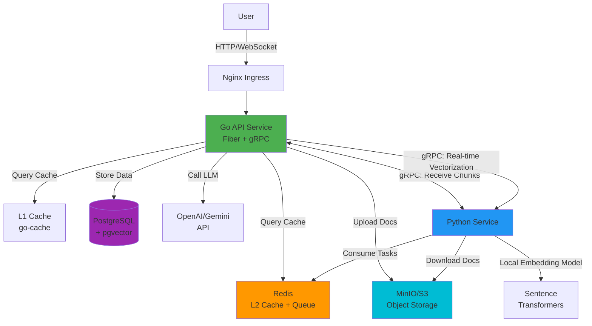
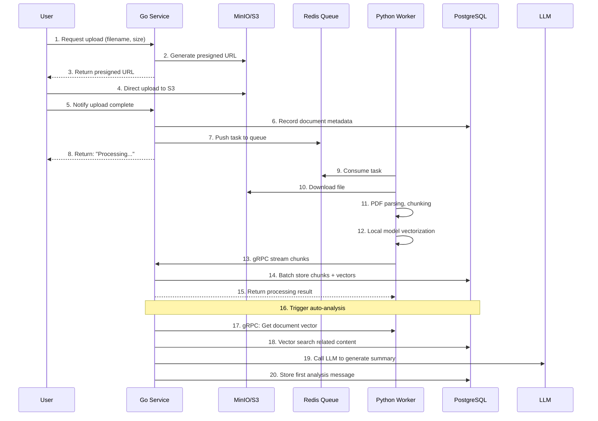
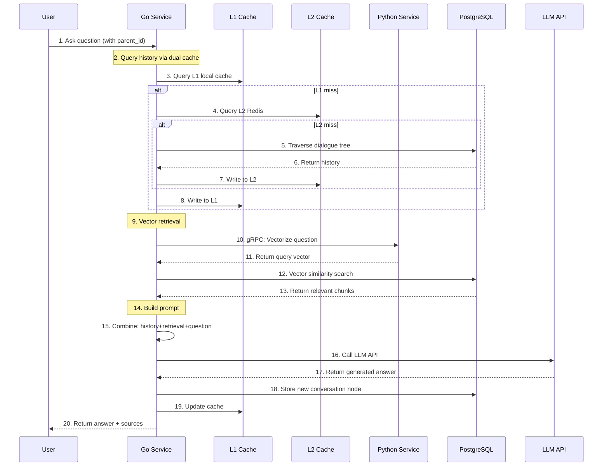

# CogniCore - Intelligent Document Q&A System

<div align="center">

**Enterprise-grade RAG (Retrieval-Augmented Generation) Platform**

[](https://golang.org/)
[](https://python.org/)
[](LICENSE)

_Document-based intelligent dialogue system providing precise and traceable AI Q&A services_

</div>

---

## 📖 Project Overview

CogniCore is a high-performance intelligent document Q&A platform utilizing RAG (Retrieval-Augmented Generation) technology. It enables users to upload PDF documents and engage in intelligent conversations based on document content. The system supports tree-structured dialogues, allowing branching questions from any historical node to construct complex knowledge exploration paths.

### ✨ Core Features

- 🚀 **High-Performance Architecture**: Go + Python microservices, gRPC communication, L1/L2 dual-layer caching
- 📚 **Intelligent Document Processing**: Automatic PDF parsing, chunking, vectorization with semantic search support
- 🌲 **Tree-Structured Dialogues**: Supports branching conversations from any historical node
- 🔍 **Hybrid Retrieval Modes**:
  - **RAG Mode**: Vector semantic search + chapter retrieval based on document content
  - **Pure Chat Mode**: Preserves chapter retrieval capability but skips vectorization for fast uploads
- 🎯 **Multi-LLM Support**: Supports mainstream models like OpenAI, Google Gemini
- 🔐 **API Key Management**: Secure key transmission and storage mechanisms
- 📦 **Object Storage**: MinIO/S3 compatible document storage
- ⚡ **Async Processing**: Redis message queue + automatic retry mechanism

### 🎯 Core Design Principles

- **Scalability**: Microservice architecture supporting horizontal scaling
- **Reliability**: Retry mechanisms, DLQ (Dead Letter Queue), graceful degradation
- **High Performance**: Dual-layer caching, batch processing, streaming transmission
- **Observability**: Structured logging, distributed tracing, performance monitoring

---

## 🏗️ System Architecture

### Technology Stack

| Layer               | Technology              | Description                                              |
| ------------------- | ----------------------- | -------------------------------------------------------- |
| **Backend Service** | Go 1.24 + Fiber         | High-performance HTTP/WebSocket API service              |
| **AI Processing**   | Python 3.11+            | Document processing, vectorization, embedding generation |
| **Database**        | PostgreSQL + pgvector   | Store documents, conversations, vector data              |
| **Cache**           | Redis + go-cache        | L1 local cache + L2 distributed cache                    |
| **Storage**         | MinIO / AWS S3          | Object storage, S3 API compatible                        |
| **RPC**             | gRPC + Protocol Buffers | Efficient inter-service communication                    |
| **Message Queue**   | Redis List              | Async task queue                                         |
| **Vectorization**   | Sentence Transformers   | Local embedding model (384 dimensions)                   |
| **LLM**             | OpenAI / Google Gemini  | External large language model APIs                       |

### Architecture Diagram



### Service Responsibilities

#### 🟢 Go API Service (Core Service)

**Ports**: 3000 (HTTP), 50051 (gRPC Server)

**Responsibilities**:

- Handle all user requests (HTTP/WebSocket)
- Document upload management (presigned URLs, metadata recording)
- Chat conversation management (dialogue tree, history)
- Dual-layer caching strategy (L1 local + L2 Redis)
- Hybrid retrieval (vector search + context retrieval)
- LLM orchestration (prompt engineering, streaming responses)
- **gRPC Server**: Receives processed document chunks from Python
- **gRPC Client**: Requests real-time text vectorization from Python

**Key Modules**:

- `handlers/`: HTTP request handling
- `services/`: Business logic (chat, documents, LLM, RAG)
- `platform/cache/`: Two-level cache implementation
- `platform/grpc/`: gRPC server and client
- `repository/`: Database access layer

#### 🔵 Python Service (AI Toolkit)

**Port**: 50053 (gRPC Server)

**Responsibilities**:

- **Redis Worker**: Background consumption of document processing tasks
- Download PDF files (from presigned URLs)
- PDF parsing, structured analysis, intelligent chunking
- Local embedding model (Sentence Transformers) for vector generation
- **gRPC Server**: Provides real-time text vectorization service
- **gRPC Client**: Streams processed document chunks to Go service

**Key Modules**:

- `app/redis_worker.py`: Main business loop
- `infra/document_infra/`: PDF processing, vectorization
- `infra/grpc_infra/`: gRPC server and client
- `service/grpc_embedding_service.py`: Embedding service

### gRPC Communication Architecture

The system implements two independent gRPC services:

| Service              | Port  | Server | Client | Purpose                                              |
| -------------------- | ----- | ------ | ------ | ---------------------------------------------------- |
| **IngestService**    | 50051 | Go     | Python | Python streams processed document chunks to Go       |
| **EmbeddingService** | 50053 | Python | Go     | Go requests real-time text vectorization from Python |

**IngestService Flow** (Python → Go):

```
Python Worker
  ↓ Process PDF, generate embeddings
  ↓ Stream: [metadata] → [chunk1] → [chunk2] → ...
  ↓
Go Service
  ↓ Receive all chunks
  ↓ Batch insert into PostgreSQL
  ↓ Return result: {chunks_stored, chunks_failed}
```

**EmbeddingService Flow** (Go → Python):

```
Go Service
  ↓ User asks "What is this document about?"
  ↓ gRPC call: GetEmbedding(text)
  ↓
Python Service
  ↓ Use local model to generate vector
  ↓ Return: [0.123, -0.456, ...]
  ↓
Go Service
  ↓ Use vector for similarity search in PostgreSQL
```

---

## 🔄 Core Workflows

### 1️⃣ Document Upload & Processing Flow



### 2️⃣ Intelligent Q&A Flow (RAG Mode)



### 3️⃣ Pure Chat Mode (Non-RAG)

When document is set to non-RAG mode:

- ✅ Preserves conversation history context
- ✅ Supports chapter-based original text retrieval (exact match)
- ✅ Direct LLM calls, fast response
- ✅ Suitable for free discussion, creative dialogue
- ❌ Does not use vector semantic search

---

## 💾 Data Model

### PostgreSQL Table Structure

```sql
-- Enable vector extension
CREATE EXTENSION IF NOT EXISTS vector;

-- Documents table
CREATE TABLE documents (
    id UUID PRIMARY KEY DEFAULT gen_random_uuid(),
    user_id UUID NOT NULL,
    filename VARCHAR(255) NOT NULL,
    storage_path TEXT NOT NULL UNIQUE,
    file_size BIGINT,
    status VARCHAR(50) NOT NULL, -- 'pending', 'processing', 'completed', 'failed'
    rag_mode BOOLEAN DEFAULT true, -- true: RAG mode, false: pure chat mode
    root_chat_id UUID, -- Dialogue tree root node
    created_at TIMESTAMPTZ DEFAULT now(),
    updated_at TIMESTAMPTZ DEFAULT now()
);

-- Document chunks table (with vectors)
CREATE TABLE document_chunks (
    id BIGSERIAL PRIMARY KEY,
    file_id UUID NOT NULL REFERENCES documents(id) ON DELETE CASCADE,
    chunk_id VARCHAR(255) NOT NULL UNIQUE,
    chapter TEXT,
    chapter_num TEXT,
    content TEXT NOT NULL,
    embedding VECTOR(384) NOT NULL, -- 384-dim vector (local model)
    chunk_index INT,
    created_at TIMESTAMPTZ DEFAULT now()
);

-- Vector index (IVFFlat, accelerates similarity search)
CREATE INDEX ON document_chunks
USING ivfflat (embedding vector_l2_ops)
WITH (lists = 100);

-- Text index (supports full-text search)
CREATE INDEX idx_chunk_content ON document_chunks USING gin(to_tsvector('english', content));

-- Chat nodes table (tree structure)
CREATE TABLE chat_nodes (
    id UUID PRIMARY KEY DEFAULT gen_random_uuid(),
    file_id UUID NOT NULL REFERENCES documents(id) ON DELETE CASCADE,
    parent_id UUID REFERENCES chat_nodes(id) ON DELETE CASCADE, -- NULL means root node
    question TEXT NOT NULL,
    answer TEXT NOT NULL,
    created_at TIMESTAMPTZ DEFAULT now()
);

-- Indexes
CREATE INDEX idx_chat_file ON chat_nodes(file_id);
CREATE INDEX idx_chat_parent ON chat_nodes(parent_id);
CREATE INDEX idx_doc_user ON documents(user_id);
CREATE INDEX idx_chunk_file ON document_chunks(file_id);
```

### Dialogue Tree Structure

The system supports tree-structured conversations, allowing branching questions from any historical node:

```
Document Analysis (root)
├─ "Summarize Chapter 1" (child 1)
│  ├─ "Key concepts in Chapter 1" (grandchild 1-1)
│  └─ "Relationship with Chapter 2" (grandchild 1-2)
└─ "Author's viewpoint" (child 2)
   └─ "What are the examples?" (grandchild 2-1)
```

Each node contains:

- `id`: Node unique identifier
- `parent_id`: Parent node ID (NULL means root node)
- `question`: User question
- `answer`: AI answer
- `file_id`: Associated document

### Caching Strategy

**L1 Cache (Local memory, go-cache)**:

- Storage: Conversation history, document metadata
- Expiration: 30 minutes - 1 hour
- Advantages: Nanosecond access, no network overhead

**L2 Cache (Redis)**:

- Storage: Conversation history, hot data
- Expiration: 1 hour
- Advantages: Shared across multiple instances, persistence support

**Cache Invalidation Strategy**:

- New conversation node → Invalidate parent node history cache
- Document status change → Invalidate document metadata cache
- Cache-Aside pattern (read cache first, on miss read DB and write to cache)

---

## 🚀 Quick Start

### Requirements

- **Go**: 1.24+
- **Python**: 3.11+
- **Docker** & **Docker Compose**: Latest version
- **PostgreSQL**: 15+ (with pgvector extension)
- **Redis**: 7+
- **MinIO** or **AWS S3**

### Method 1: Docker Compose (Recommended)

#### 1. Clone Project

```bash
git clone <repository-url>
cd Reading_project
```

#### 2. Start Infrastructure

```bash
cd go_chat_backend
docker-compose up -d
```

This will start:

- PostgreSQL (port 5432)
- Redis (port 6379)
- MinIO (port 9000, console 9001)

Access MinIO console: http://localhost:9001

- Username: `minioadmin`
- Password: `minioadmin`

#### 3. Initialize Database

```bash
# Connect to PostgreSQL
psql -h localhost -U postgres -d go_chat_db

# Execute SQL (see "Data Model" section)
CREATE EXTENSION IF NOT EXISTS vector;
-- ... other table creation statements
```

#### 4. Configure Environment Variables

**Go Service** (`go_chat_backend/.env`):

```bash
cp .env.example .env
# Edit .env to configure database, Redis, MinIO
```

**Python Service** (`pdf_processor/.env`):

```bash
cp .env.example .env
# Edit .env with same connection info as Go service
```

#### 5. Start Go Service

```bash
cd go_chat_backend
go mod download
go run main.go
```

Service runs on: http://localhost:3000

#### 6. Start Python Service

```bash
cd pdf_processor
python -m venv .venv
source .venv/bin/activate  # Windows: .venv\Scripts\activate
pip install -r requirements.txt

# Generate gRPC code
python -m grpc_tools.protoc \
  -I./infra/grpc_infra/protos \
  --python_out=./infra/grpc_infra/protos \
  --grpc_python_out=./infra/grpc_infra/protos \
  ./infra/grpc_infra/protos/cognicore.proto

# Start service
python main.py
```

### Method 2: Manual Setup

#### 1. Install PostgreSQL + pgvector

```bash
# macOS
brew install postgresql@15
brew install pgvector

# Ubuntu
sudo apt install postgresql-15 postgresql-15-pgvector
```

#### 2. Install Redis

```bash
# macOS
brew install redis
brew services start redis

# Ubuntu
sudo apt install redis-server
sudo systemctl start redis
```

#### 3. Install MinIO

```bash
# macOS
brew install minio
minio server ~/minio-data --console-address ":9001"
```

#### 4. Follow Docker Compose steps 4-6 to start services

### Test Endpoints

#### 1. Health Check

```bash
curl http://localhost:3000/health
# Response: {"status": "ok"}
```

#### 2. Upload Document

```bash
# Step 1: Get presigned URL
curl -X POST http://localhost:3000/api/v1/documents/presigned-url \
  -H "Content-Type: application/json" \
  -d '{
    "filename": "test.pdf",
    "file_size": 1024000,
    "user_id": "user-123"
  }'

# Response: {"upload_url": "http://...", "doc_id": "..."}

# Step 2: Upload file to presigned URL
curl -X PUT "<upload_url>" \
  -H "Content-Type: application/pdf" \
  --upload-file test.pdf

# Step 3: Notify upload complete
curl -X POST http://localhost:3000/api/v1/documents/upload-success \
  -H "Content-Type: application/json" \
  -d '{
    "doc_id": "<doc_id>",
    "user_id": "user-123"
  }'
```

#### 3. Ask Question

```bash
curl -X POST http://localhost:3000/api/v1/chat/ask \
  -H "Content-Type: application/json" \
  -d '{
    "file_id": "<doc_id>",
    "question": "What is this document about?",
    "parent_id": "",
    "user_id": "user-123",
    "api_key": "your-openai-api-key",
    "provider": "openai",
    "model": "gpt-4"
  }'
```

#### 4. Get Dialogue Tree

```bash
curl http://localhost:3000/api/v1/chat/tree/<doc_id>
```

---

## 📡 API Documentation

### RESTful API

#### 1. Health Check

```http
GET /health
```

**Response**:

```json
{
  "status": "ok"
}
```

#### 2. Document Upload Flow

**Step 1: Get Presigned URL**

```http
POST /api/v1/documents/presigned-url
Content-Type: application/json

{
  "filename": "example.pdf",
  "file_size": 1024000,
  "user_id": "user-123",
  "rag_mode": true  // Optional, default true
}
```

**Response**:

```json
{
  "upload_url": "http://minio:9000/documents/...",
  "doc_id": "uuid-xxx",
  "expires_at": "2025-11-09T10:00:00Z"
}
```

**Step 2: Upload File**

```http
PUT <upload_url>
Content-Type: application/pdf
Body: <binary-pdf-data>
```

**Step 3: Notify Upload Complete**

```http
POST /api/v1/documents/upload-success
Content-Type: application/json

{
  "doc_id": "uuid-xxx",
  "user_id": "user-123"
}
```

**Response**:

```json
{
  "success": true,
  "message": "Document processing...",
  "doc_id": "uuid-xxx"
}
```

#### 3. Chat Conversation

**Ask Question**

```http
POST /api/v1/chat/ask
Content-Type: application/json

{
  "file_id": "uuid-xxx",
  "question": "What is the main content of this document?",
  "parent_id": "",  // Empty string for root, otherwise parent node ID
  "user_id": "user-123",
  "api_key": "sk-...",  // User's LLM API Key
  "provider": "openai",  // "openai" or "gemini"
  "model": "gpt-4"  // or "gemini-pro"
}
```

**Response**:

```json
{
  "id": "node-uuid",
  "answer": "This document mainly discusses...",
  "question": "What is the main content of this document?",
  "tree": {
    "id": "root-uuid",
    "question": "",
    "answer": "Document auto-analysis...",
    "children": [
      {
        "id": "node-uuid",
        "question": "What is the main content of this document?",
        "answer": "This document mainly discusses...",
        "children": []
      }
    ]
  }
}
```

**Branch Question from Historical Node**

```http
POST /api/v1/chat/ask
Content-Type: application/json

{
  "file_id": "uuid-xxx",
  "question": "Can you elaborate on the third point?",
  "parent_id": "node-uuid",  // Specify parent node ID
  "user_id": "user-123",
  "api_key": "sk-...",
  "provider": "openai",
  "model": "gpt-4"
}
```

**Question with Specific Chapter (Supports both modes)**

```http
POST /api/v1/chat/ask
Content-Type: application/json

{
  "file_id": "uuid-xxx",
  "question": "What is the core viewpoint of this chapter?",
  "section": "Chapter 3 Case Studies",  // Specify chapter to retrieve
  "parent_id": "",
  "user_id": "user-123",
  "api_key": "sk-...",
  "provider": "openai",
  "model": "gpt-4"
}
```

> 💡 **Tips**:
>
> - `section` parameter works in both RAG and non-RAG modes
> - RAG mode: Chapter retrieval + Vector search (dual retrieval)
> - Non-RAG mode: Chapter retrieval only (fast location)

#### 4. Get Dialogue Tree

```http
GET /api/v1/chat/tree/<file_id>
```

**Response**:

```json
{
  "id": "root-uuid",
  "question": "",
  "answer": "Document auto-analysis result...",
  "children": [
    {
      "id": "child-1",
      "question": "What did Chapter 1 discuss?",
      "answer": "Chapter 1 mainly...",
      "children": [
        {
          "id": "grandchild-1",
          "question": "What are some examples?",
          "answer": "For example...",
          "children": []
        }
      ]
    },
    {
      "id": "child-2",
      "question": "Summarize the full text",
      "answer": "Overall summary...",
      "children": []
    }
  ]
}
```

#### 5. Set Document RAG Mode

```http
POST /api/v1/documents/<doc_id>/rag-mode
Content-Type: application/json

{
  "rag_mode": false  // true: RAG mode, false: pure chat mode
}
```

### gRPC API

#### IngestService (Python → Go)

**Port**: 50051

**Method**: `IngestDocument(stream IngestRequest) returns (IngestResponse)`

**Flow**:

1. Python sends `DocumentMetadata`
2. Python streams `TextChunk` (with vectors)
3. Go batch stores to PostgreSQL
4. Go returns `IngestResponse`

#### EmbeddingService (Go → Python)

**Port**: 50053

**Method**: `GetEmbedding(EmbeddingRequest) returns (EmbeddingResponse)`

**Request**:

```protobuf
message EmbeddingRequest {
  string task_id = 1;
  string text = 2;
  string api_key = 3;  // Optional, not needed for local model
  string provider = 4;  // "local", "openai", "gemini"
}
```

**Response**:

```protobuf
message EmbeddingResponse {
  bool success = 1;
  string message = 2;
  repeated float embeddings = 3;  // 384-dim vector
  int32 dimension = 4;
}
```

---

## 🎯 Core Features Deep Dive

### 1. Dual-Layer Caching Strategy

**Architecture**:

```
User Request
  ↓
L1 Cache (In-memory, go-cache)
  ↓ Miss
L2 Cache (Redis)
  ↓ Miss
PostgreSQL
  ↓
Write back to L2 → Write back to L1
```

**Performance Comparison**:

- L1 hit: < 1ms
- L2 hit: 2-5ms
- DB query: 10-50ms

**Implementation Example**:

```go
func (s *ChatService) GetHistoryByID(ctx context.Context, parentID string) ([]*models.ChatNode, error) {
    cacheKey := fmt.Sprintf("chat_node:%s:%s", fileID, parentID)

    // L1 query
    if cached, ok := s.cacheService.GetCache(cacheKey); ok {
        return cached.([]*models.ChatNode), nil
    }

    // Database query
    history, err := s.chatRepo.GetChatHistory(ctx, fileID, parentID)

    // Write back to cache
    s.cacheService.SetCache(cacheKey, history, 30*time.Minute)
    return history, nil
}
```

### 2. RAG vs Pure Chat Mode

**RAG Mode** (`rag_mode: true`):

- ✅ Precise Q&A based on document content
- ✅ **Vector semantic search**, returns relevant segments
- ✅ Traceable answers with source citations
- ✅ Intelligent understanding of semantic relevance
- ⚡ Vectorization overhead: Initial upload requires 384-dim vector generation

**Pure Chat Mode** (`rag_mode: false`):

- ✅ Fast upload, no vectorization overhead
- ✅ **Supports chapter retrieval** (exact match by chapter name)
- ✅ Preserves conversation context
- ✅ Direct LLM conversation, suitable for free discussion
- ❌ Does not support vector semantic search

**Mode Comparison**:

| Feature           | RAG Mode                                     | Pure Chat Mode                                  |
| ----------------- | -------------------------------------------- | ----------------------------------------------- |
| Vectorization     | ✅ Generate 384-dim vectors                  | ❌ Zero vectors as placeholders                 |
| Semantic Search   | ✅ Based on vector similarity                | ❌ Not supported                                |
| Chapter Retrieval | ✅ Supported (exact match)                   | ✅ Supported (exact match)                      |
| Upload Speed      | Slower (requires vectorization)              | Fast (skip vectorization)                       |
| Use Cases         | Precise document Q&A, semantic understanding | Free discussion, quick browsing, known chapters |

**Retrieval Strategy Comparison**:

```
RAG Mode Q&A Flow:
├─ 1. Check if section specified → Exact chapter retrieval
├─ 2. Vectorize question → Semantic search for relevant segments
└─ 3. Combine: Chapter content + Similar segments + History → Send to LLM

Non-RAG Mode Q&A Flow:
├─ 1. Check if section specified → Exact chapter retrieval
├─ 2. Skip vector search
└─ 3. Combine: Chapter content + History → Send to LLM
```

**Actual Code Logic** (`BuildPrompt` function):

```go
// Step 1: Chapter retrieval (both modes support)
if section != "" {
    chunkContext, _ := s.chunkRepository.GetNodeBySection(ctx, section, fileID)
    // SQL: SELECT * FROM document_chunks WHERE chapter = ? AND file_id = ?
    builder.WriteString(fmt.Sprintf("Section %s:\n%s\n\n", section, chunkContext.ChunkText))
}

// Step 2: Vector search (RAG mode only)
if ragMode {
    embedding, _ := s.GRPCService.GetEmbedding(question)
    similar, _ := s.chunkRepository.SearchSimilar(ctx, embedding, 1)
    // SQL: SELECT * FROM document_chunks ORDER BY embedding <=> ? LIMIT 1
    builder.WriteString(fmt.Sprintf("Similar context:\n%s\n\n", similar[0].ChunkText))
}
```

**Mode Switching Example**:

```bash
# Switch to pure chat mode
curl -X POST http://localhost:3000/api/v1/documents/<doc_id>/rag-mode \
  -H "Content-Type: application/json" \
  -d '{"rag_mode": false}'

# Switch back to RAG mode
curl -X POST http://localhost:3000/api/v1/documents/<doc_id>/rag-mode \
  -H "Content-Type: application/json" \
  -d '{"rag_mode": true}'
```

### 3. Async Processing & Retry Mechanism

**Flow**:

```
1. Task enqueue (Redis List)
2. Python Worker consumes
3. Processing failed?
   ├─ Yes → retry_count < 3?
   │    ├─ Yes → Exponential backoff retry (2^n seconds)
   │    └─ No → Move to DLQ
   └─ No → Success
```

### 4. Vector Search & Chapter Retrieval

The system supports two retrieval methods:

#### Method 1: Vector Semantic Search (RAG mode only)

Find semantically related content through vector similarity:

**Query Statement**:

```sql
SELECT
    chunk_id,
    content,
    chapter,
    1 - (embedding <=> $1) AS similarity
FROM document_chunks
WHERE file_id = $2
ORDER BY embedding <=> $1  -- Cosine distance
LIMIT 5;
```

**Parameters**: `$1`: Query vector (384-dim), `$2`: Document ID

**Advantages**: Understands semantic relevance, cross-chapter intelligent search, fuzzy matching

#### Method 2: Chapter Exact Retrieval (Both modes support)

Exact match by chapter name:

**Query Statement**:

```sql
SELECT * FROM document_chunks
WHERE chapter = $1 AND file_id = $2
LIMIT 1;
```

**Usage Example**:

```json
{
  "question": "What does this chapter discuss?",
  "section": "Chapter 1 Overview", // Specify chapter name
  "file_id": "uuid-xxx"
}
```

**Advantages**: Fast location of specific chapters, no vectorization needed, zero latency

---

## 📁 Project Structure

```
Reading_project/
├── go_chat_backend/          # Go backend service
│   ├── main.go
│   ├── config/               # Configuration management
│   ├── handlers/             # HTTP handlers
│   ├── services/             # Business logic
│   ├── repository/           # Data access layer
│   ├── platform/             # Infrastructure
│   │   ├── cache/           # Cache implementation
│   │   ├── grpc/            # gRPC server and client
│   │   ├── redis/           # Redis connection
│   │   └── storage/         # S3/MinIO client
│   └── models/              # Data models
│
└── pdf_processor/            # Python AI service
    ├── main.py
    ├── app/                  # Application layer
    │   ├── redis_worker.py  # Redis task consumer
    │   └── doc_streamer.py  # Document streaming
    ├── service/             # gRPC service
    └── infra/               # Infrastructure
        ├── bucket_infra/    # Object storage
        ├── document_infra/  # Document processing
        └── grpc_infra/      # gRPC infrastructure
```

---

## 🐛 Common Issues

### Q1: Document stuck in "Processing"

**Solution**:

```bash
# Check Python service status
ps aux | grep python

# View logs
tail -f pdf_processor/logs/app.log

# Check Redis connection
redis-cli ping
```

### Q2: gRPC Connection Failed

**Solution**:

```bash
# Check port usage
lsof -i :50051
lsof -i :50053

# Test gRPC connection
grpcurl -plaintext localhost:50053 list
```

### Q3: Vector Search Returns Irrelevant Results

**Solution**:

```sql
-- Check vector dimensions
SELECT pg_typeof(embedding) FROM document_chunks LIMIT 1;

-- Rebuild index
DROP INDEX IF EXISTS document_chunks_embedding_idx;
CREATE INDEX ON document_chunks
USING ivfflat (embedding vector_l2_ops)
WITH (lists = 100);
```

---

## 📊 Performance Optimization

### 1. Database Optimization

```sql
-- Regular VACUUM
VACUUM ANALYZE document_chunks;

-- Adjust index parameters
CREATE INDEX ON document_chunks
USING ivfflat (embedding vector_l2_ops)
WITH (lists = 200);  -- Adjust based on data volume
```

### 2. Cache Optimization

```go
// Extend expiration for hot data
s.cacheService.SetCache(key, value, 1*time.Hour)

// Cache warmup
func (s *ChatService) WarmupCache(ctx context.Context, fileID string) {
    history, _ := s.chatRepo.GetChatHistory(ctx, fileID, rootID)
    s.cacheService.SetCache(cacheKey, history, time.Hour)
}
```

### 3. Concurrent Processing

```python
# Increase gRPC worker threads
server = grpc.server(
    futures.ThreadPoolExecutor(max_workers=50),
)
```

---

## 🚢 Deployment

### Docker Compose

```bash
# Build and start
docker-compose up -d

# View logs
docker-compose logs -f
```

### Environment Variables

**Go Service**:

```env
PORT=3000
PG_HOST=localhost
PG_USER=postgres
PG_PASSWORD=your-password
REDIS_URL=redis://localhost:6379
BUCKET_ENDPOINT=localhost:9000
GO_GRPC_INGEST_PORT=50051
GRPC_EMBEDDING_ADDR=localhost:50053
```

**Python Service**:

```env
REDIS_URL=redis://localhost:6379
BUCKET_ENDPOINT=localhost:9000
EMBEDDING_MODEL_NAME=paraphrase-multilingual-MiniLM-L12-v2
GO_GRPC_INGEST_ADDR=localhost:50051
GRPC_EMBEDDING_PORT=50053
```

---

## 🤝 Contributing

Contributions are welcome! Please follow:

1. Fork the project
2. Create a feature branch
3. Commit your changes
4. Open a Pull Request

---

## 📄 License

MIT License

---

## 📚 Related Resources

- [Fiber Documentation](https://docs.gofiber.io/)
- [pgvector](https://github.com/pgvector/pgvector)
- [gRPC Go](https://grpc.io/docs/languages/go/)
- [Sentence Transformers](https://www.sbert.net/)

---

**Last Updated**: 2025-11-09
**Document Version**: v3.0
**Project Status**: ✅ Production Ready
