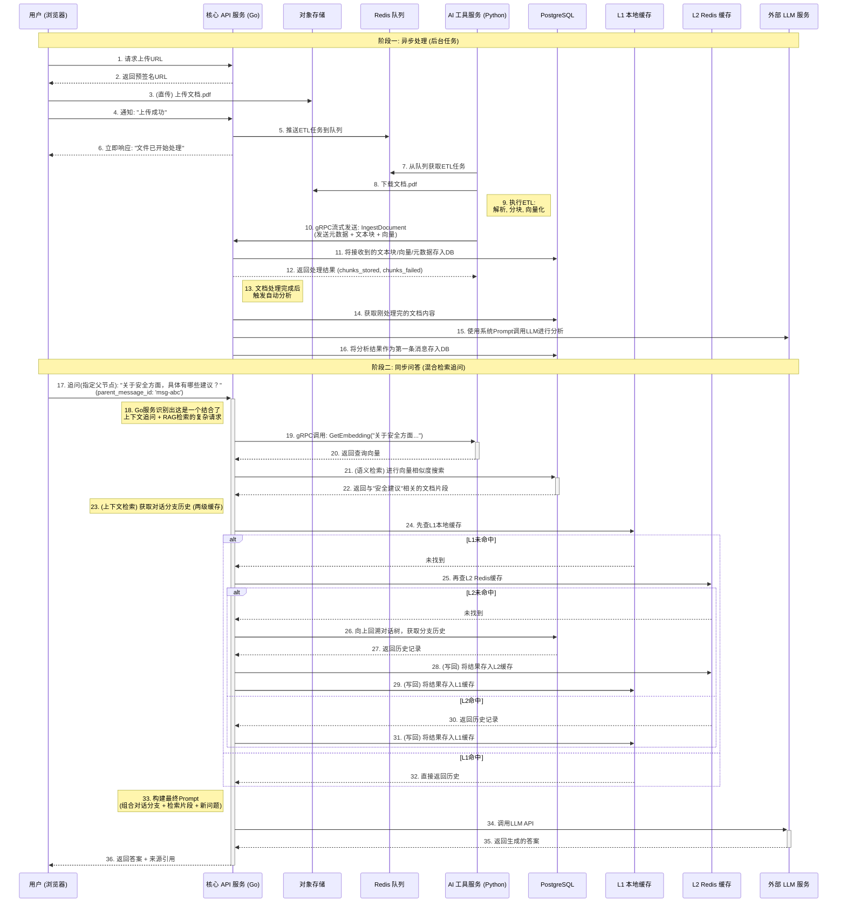

# 项目设计说明书："CogniCore" 智能 RAG 应用平台

**项目代号**: CogniCore
**版本**: 2.6 (gRPC 架构更新版)
**日期**: 2025 年 11 月 04 日
**文档状态**: 定稿

## 1.0 项目愿景与核心原则

### 1.1 项目愿景

"CogniCore" 旨在构建一个极致性能、企业级的检索增强生成（RAG）平台。它不仅是一个聊天应用，更是一个可扩展的智能核心，能够集成各类文档知识库，为用户提供精准、有据依依、可追溯来源的智能问答服务。

### 1.2 核心设计原则

- **可扩展性 (Scalability)**: 架构必须能够平滑地从服务少量用户扩展到服务数百万用户，并能弹性应对突发流量。
- **可靠性 (Reliability)**: 系统必须具备高可用性和容错能力，关键任务（如文件处理）不因单点故障而丢失或中断。
- **可观测性 (Observability)**: 系统的每一个组件都必须是"透明"的，其状态、性能和错误都应易于监控、追踪和诊断。
- **高性能 (Performance)**: (核心原则) 通过多级缓存策略将实时交互的延迟降至最低，并通过异步处理将后台任务的吞吐量最大化。

## 2.0 核心技术栈

| 类别             | 技术                             | 用途与说明                                                     |
| ---------------- | -------------------------------- | -------------------------------------------------------------- |
| 核心 API 服务    | Go, Fiber                        | 处理高并发 HTTP/WebSocket，作为系统主入口和智能检索编排中心    |
| AI 工具服务      | Python                           | 运行 gRPC 服务和后台异步 Worker，专注于文本处理与向量化        |
| 数据库           | PostgreSQL, pgvector             | 结构化数据、向量数据及其元数据统一存储，作为持久化数据源       |
| L1 缓存 (本地)   | Go-cache / Concurrent Map        | 在 Go 服务实例内存中实现的本地缓存，提供纳秒级访问速度         |
| L2 缓存 (分布式) | Redis                            | 作为所有 Go 服务实例共享的分布式缓存，并兼作异步任务的消息代理 |
| 对象存储         | S3 API 兼容服务 (MinIO)          | 存储用户上传的文档等非结构化数据                               |
| 内部同步通信     | gRPC                             | 用于 Go 和 Python 服务间低延迟、强类型的同步 RPC 调用          |
| 容器化与部署     | Docker, Kubernetes               | 应用打包、部署、扩展和管理                                     |
| 服务伸缩         | KEDA                             | 基于事件驱动（如 Redis 队列长度）的智能自动伸缩                |
| 可观测性         | EFK, Prometheus, Grafana, Jaeger | 日志、指标、追踪的全方位监控体系                               |

## 3.0 系统架构

### 3.1 宏观架构图

```
+---------------------------------------------------------------------------------------------+
| Kubernetes Production Cluster                                                               |
|                                                                                             |
|  +-------------------------+                                                                |
|  | External LLM Service    |                                                                |
|  | (e.g., Google Gemini)   |                                                                |
|  +------------+------------+                                                                |
|               ^                                                                             |
|               | (User's API Key Forwarded)                                                |
|               |                                                                             |
|  +------------+------------+              +---------------------------------------------+  |
|  | Observability Stack     |              | User-Facing Traffic                         |  |
|  | - Prometheus (Metrics)  |              | (HTTPS/WSS)                                 |  |
|  | - Jaeger (Tracing)      |              |    v                                        |  |
|  | - EFK (Logging)         |              | +-------------------------+                 |  |
|  +-------------------------+              | | Ingress Controller      |                 |  |
|       ^ ^ ^                               | +------------+------------+                 |  |
|       | | |                               |              |                              |  |
|  +----+ | +----+                          |              v                              |  |
|  | Metrics    | Traces  Logs |            | +------------+-------------------+         |  |
|  |            |              |            | | Core API Service (Go/Fiber)     |         |  |
|  |            |              |            | | (K8s Deployment, HPA)           |         |  |
|  |            v              v            | | - Auth, Orchestration, Caching |         |  |
|  |  +---------+--------------+--+         | | - Prompt Engineering            |         |  |
|  |  | Core API Service (Go)    <---------+ | - Direct LLM API Calls          |         |  |
|  |  | gRPC Client & Server     |  gRPC   | | - gRPC Client: APIKey, Embedding|         |  |
|  |  +--------+-+-------+-------+         | | - gRPC Server: IngestService    |         |  |
|  |           | |       |                  | +--------+------------------------+         |  |
|  |      gRPC | | Redis |  gRPC            |          |                                  |  |
|  |    (API   | | Queue | (Embedding)      |          v                                  |  |
|  |     Key)  | |       |                  | +--------+------------------------+         |  |
|  |           v v       v                  | | AI Utility Service (Python)     |         |  |
|  |  +--------+----------+---------+       | | (K8s Deployment, KEDA)          |         |  |
|  |  | AI Utility Service (Python) |       | | - Port 50052: API Key Server    |         |  |
|  |  | 三合一架构:                  |       | | - Port 50053: Embedding Server  |         |  |
|  |  | 1. gRPC API Key Server     |       | | - Redis Worker: ETL Pipeline    |         |  |
|  |  | 2. gRPC Embedding Server   |       | +-------------------------------------+  |  |
|  |  | 3. Redis Async Worker      |       |          |        |          |               |  |
|  |  +----------------------------+       |    +-----v-----+  +v---------+ +v--------+   |  |
|               |         |         |            | Redis     |  | S3/MinIO | |PostgreSQL||  |
|         +-----v-----+   v    +----v-----+      |(StatefulSet)| (External) |(StatefulSet)|  |
|         | Redis     |        | S3/MinIO |       +-----------+  +----------+ +----------+|  |
|         | (StatefulSet)     | (External)|                                              |  |
|         +-----------+        +----------+                                               |  |
|               |                   |                                                     |  |
|         +-----v-------+    +------v------+                                              |  |
|         | PostgreSQL  |    |             |                                              |  |
|         | (StatefulSet)    |             |                                              |  |
|         +-------------+    +-------------+                                              |  |
+---------------------------------------------------------------------------------------------+
```

### 3.2 服务组件拆解

#### Core API Service (Go)

**职责**: (职责扩展) 系统的总入口、智能混合检索引擎，并内建两级缓存。

- 负责用户认证、会话管理、处理所有面向用户的 API 和 WebSocket 请求。
- **文档管理**:
  - 处理用户上传请求，生成 S3 预签名 URL
  - 记录文档元数据到 PostgreSQL
  - 将 ETL 任务推送到 Redis 队列
- **gRPC 通信**:
  - **作为客户端**:
    - 调用 Python Embedding Service (端口 50053) 获取文本向量
    - 调用 Python API Key Service (端口 50052) 传递用户的 API 密钥
  - **作为服务端**:
    - 监听 Python 的 IngestService 客户端连接 (端口 50051)
    - 接收处理后的文档块和嵌入向量
    - 将数据持久化到 PostgreSQL

**实现两级缓存策略 (L1 + L2 Caching)**:

- **L1 本地缓存**: 在每个 Go 服务实例的内存中维护一个高速缓存（使用 go-cache 等库）。
- **L2 分布式缓存**: 使用 Redis 作为所有 Go 服务实例共享的二级缓存。
- **数据读取流程**: 遵循 查询 L1 -> L1 未命中 -> 查询 L2 -> L2 未命中 -> 查询 PostgreSQL 的顺序。
- **数据写入/更新流程**: 采用"缓存失效 (Cache Invalidation)"策略。

智能识别用户查询意图并执行混合检索策略。执行 Prompt 工程，直接调用外部 LLM 服务，并转发用户提供的 API 密钥。

#### AI Utility Service (Python) - AI 工具箱

**定位**: 一个专注的、轻量级的"AI 工具箱"，负责所有与文本预处理和向量化相关的重计算。

**核心职责**:

- (异步) 文档解析、分块及元数据提取。
- (异步和同步) 文本向量化，调用外部 LLM API 生成嵌入向量。

**三合一运行架构** (在 `main.py` 中同时启动):

1. **gRPC API Key Server (端口 50052)**

   - 接收 Go 服务发送的 API 密钥
   - 使用异步事件机制存储和分发密钥
   - 支持多个并发任务的密钥管理
   - 实现文件: `tasks/grpc_api_key.py`

2. **gRPC Embedding Server (端口 50053)**

   - 提供实时文本向量化服务
   - 支持 OpenAI 和 Gemini 两种提供商
   - 接收文本，返回嵌入向量
   - 实现文件: `tasks/grpc_embedding.py`

3. **Redis Worker (后台异步)**
   - 从 Redis 队列消费 ETL 任务
   - 完整的 PDF 处理流程：
     - 下载 PDF (从 S3 预签名 URL)
     - 解析和分块
     - 等待 API 密钥 (从 gRPC API Key Server)
     - 生成嵌入向量
     - 通过 gRPC 流式发送到 Go 服务 (IngestService)
   - 失败重试机制 (指数退避，最多 3 次)
   - Dead Letter Queue (DLQ) 处理
   - 实现文件: `tasks/redis_worker.py`

**启动方式**:

```python
# main.py
async def main():
    loop = asyncio.get_running_loop()
    set_main_event_loop(loop)

    # 启动两个 gRPC 服务器（后台线程）
    api_key_server = start_grpc_server()        # 端口 50052
    embedding_server = start_embedding_grpc_server()  # 端口 50053

    # 在主事件循环运行 Redis Worker
    await redis_main_loop()
```

### 3.3 核心流程时序图 (Core Workflow Sequence Diagram)

本图描绘了系统两大核心流程的详细交互步骤。



## 4.0 数据模型与接口契约

### 4.1 数据模型 (PostgreSQL)

```sql
-- 开启 pgvector 插件
CREATE EXTENSION IF NOT EXISTS vector;

-- 用户表
CREATE TABLE users (
    id UUID PRIMARY KEY,
    email TEXT NOT NULL UNIQUE,
    password_hash TEXT NOT NULL,
    created_at TIMESTAMPTZ DEFAULT now()
);

-- 聊天会话表
CREATE TABLE chat_sessions (
    id UUID PRIMARY KEY,
    user_id UUID NOT NULL REFERENCES users(id),
    title VARCHAR(255) NOT NULL,
    created_at TIMESTAMPTZ DEFAULT now()
);

-- 聊天消息表 (树状结构)
CREATE TABLE chat_messages (
    id UUID PRIMARY KEY,
    session_id UUID NOT NULL REFERENCES chat_sessions(id),
    parent_message_id UUID REFERENCES chat_messages(id), -- 指向父消息，实现树状结构
    role TEXT NOT NULL CHECK (role IN ('user', 'assistant')),
    content TEXT NOT NULL,
    metadata JSONB,
    created_at TIMESTAMPTZ DEFAULT now()
);

-- 上传文件表
CREATE TABLE uploaded_files (
    id UUID PRIMARY KEY,
    user_id UUID NOT NULL REFERENCES users(id),
    filename VARCHAR(255) NOT NULL,
    storage_path TEXT NOT NULL UNIQUE,
    status TEXT NOT NULL,
    created_at TIMESTAMPTZ DEFAULT now()
);

-- 文件块与向量表 (带元数据)
CREATE TABLE file_chunks (
    id BIGSERIAL PRIMARY KEY,
    file_id UUID NOT NULL REFERENCES uploaded_files(id),
    chunk_text TEXT NOT NULL,
    embedding VECTOR(384) NOT NULL,
    metadata JSONB -- 存储来源信息，如页码、章节
);

CREATE INDEX ON file_chunks USING ivfflat (embedding vector_l2_ops) WITH (lists = 100);
```

### 4.2 API & RPC 接口契约

#### RESTful API 契约 (Go Service)

- **POST** `/api/v1/auth/register`, **POST** `/api/v1/auth/login`
- **GET** `/api/v1/chats`, **POST** `/api/v1/chats`
- **POST** `/api/v1/chats/{chat_id}/messages` (body 中可包含 parent_message_id)
- **POST** `/api/v1/files/presigned-url`, **POST** `/api/v1/files/upload-success`
- **POST** `/internal/analyze-file` (内部 API，由 Python 服务调用)

#### gRPC 接口契约 (cognicore.proto)

**当前系统实现了三个独立的 gRPC 服务，各司其职：**

##### 1. IngestService (Python 客户端 → Go 服务端，端口 50051)

**用途**: Python Worker 将处理后的文档块流式传输给 Go 服务

```protobuf
syntax = "proto3";
package cognicore;

service IngestService {
  // 流式上传：Python 持续发送文档数据，Go 最后返回 ACK
  rpc IngestDocument(stream IngestRequest) returns (IngestResponse);

  // 单个块上传（用于重试）
  rpc IngestSingleChunk(TextChunk) returns (IngestResponse);
}

message IngestRequest {
  oneof request_type {
    DocumentMetadata metadata = 1;  // 第一条消息：元信息
    TextChunk chunk = 2;             // 后续消息：文本块
  }
}

message DocumentMetadata {
  string file_id = 1;
  string user_id = 2;
  string filename = 3;
  int32 total_pages = 4;
  int32 estimated_chunks = 5;
  string file_hash = 6;
  int64 file_size = 7;
  string created_at = 8;
}

message TextChunk {
  string chunk_id = 1;
  string file_id = 2;
  string chapter = 3;
  string chunk_text = 5;
  repeated float embedding_vector = 6;  // 嵌入向量
  int32 chunk_index = 8;
}

message IngestResponse {
  bool success = 1;
  string message = 2;
  int32 chunks_received = 3;
  int32 chunks_stored = 4;
  int32 chunks_failed = 5;
  int64 processing_time_ms = 7;
  string file_id = 8;
}
```

**实现文件**:

- Go 服务端: `go_chat_backend/platform/grpc/chunk/grpc_chunk.go`
- Python 客户端: `pdf_processor/services/ingest_client.py`

##### 2. APIKeyService (Go 客户端 → Python 服务端，端口 50052)

**用途**: Go 服务将用户的 API 密钥传递给 Python Worker

```protobuf
service APIKeyService {
  rpc ProvideAPIKey(APIKeyRequest) returns (APIKeyResponse);
}

message APIKeyRequest {
  string task_id = 1;   // 任务 ID
  string api_key = 2;   // API Key (OpenAI, Gemini, etc.)
  string provider = 3;  // Provider name: "openai" or "gemini"
}

message APIKeyResponse {
  bool success = 1;
  string message = 2;
}
```

**实现文件**:

- Go 客户端: `go_chat_backend/platform/grpc/api_key/grpc_apikey.go`
- Python 服务端: `pdf_processor/tasks/grpc_api_key.py`

**工作流程**:

1. Go 服务接收用户上传请求和 API 密钥
2. 通过 gRPC 调用 Python 的 APIKeyService
3. Python 使用异步事件机制存储密钥
4. Python Worker 等待并获取对应任务的 API 密钥

##### 3. EmbeddingService (Go 客户端 → Python 服务端，端口 50053)

**用途**: Go 服务请求 Python 进行实时文本向量化

```protobuf
service EmbeddingService {
  rpc GetEmbedding(EmbeddingRequest) returns (EmbeddingResponse);
}

message EmbeddingRequest {
  string task_id = 1;   // 任务 ID（用于日志追踪）
  string text = 2;      // 要向量化的文本
  string api_key = 3;   // API Key
  string provider = 4;  // Provider name: "openai" or "gemini"
}

message EmbeddingResponse {
  bool success = 1;
  string message = 2;
  repeated float embeddings = 3;  // 向量结果
  int32 dimension = 4;             // 向量维度
}
```

**实现文件**:

- Go 客户端: `go_chat_backend/platform/grpc/embedding/grpc_embedding.go`
- Python 服务端: `pdf_processor/tasks/grpc_embedding.py`

**支持的 Provider**:

- **OpenAI**: text-embedding-3-small (1536 维度)
- **Gemini**: models/text-embedding-004 (768 维度)

#### gRPC 架构说明

**服务角色总结**:
| 服务 | 端口 | 服务端 | 客户端 | 用途 |
|------|------|--------|--------|------|
| IngestService | 50051 | Go | Python | 接收处理后的文档块 |
| APIKeyService | 50052 | Python | Go | 传递 API 密钥 |
| EmbeddingService | 50053 | Python | Go | 实时文本向量化 |

**Proto 文件位置**:

- `go_chat_backend/platform/proto/cognicore.proto`
- `pdf_processor/protos/cognicore.proto`

---

## 附录：架构更新说明

### 版本 2.6 更新内容 (2025-11-04)

**主要变更：gRPC 三服务架构实现**

本次更新完善了 Go 和 Python 服务之间的 gRPC 通信架构，将原有的单一向量化服务扩展为三个独立的 gRPC 服务，各司其职，提升了系统的模块化和可维护性。

#### 1. 新增 IngestService (Python → Go)

- **端口**: 50051
- **用途**: Python Worker 将处理后的文档块流式传输到 Go 服务
- **特性**:
  - 支持流式传输，降低内存占用
  - 先发送文档元数据，再流式发送所有文本块
  - 每个文本块包含完整的嵌入向量

#### 2. 新增 APIKeyService (Go → Python)

- **端口**: 50052
- **用途**: Go 服务将用户提供的 API 密钥传递给 Python
- **特性**:
  - 使用异步事件机制进行密钥分发
  - 支持多个并发任务的密钥管理
  - 30 秒超时保护

#### 3. 增强 EmbeddingService (Go → Python)

- **端口**: 50053
- **用途**: 实时文本向量化服务
- **特性**:
  - 支持 OpenAI 和 Gemini 两种提供商
  - 请求中包含 API 密钥和 provider 信息
  - 返回嵌入向量和维度信息

#### 4. Python 服务三合一架构

Python 服务（`pdf_processor/main.py`）现在同时运行：

- 两个 gRPC 服务器（在后台线程中）
- 一个 Redis Worker（在主事件循环中）

#### 5. 重试和错误处理机制

- 失败任务自动重试，最多 3 次
- 指数退避策略（2^retry_count 秒）
- 超过最大重试次数的任务移入 Dead Letter Queue (DLQ)

#### 6. 配置变更

新增环境变量：

```env
# Go 服务
GO_GRPC_INGEST_PORT=:50051
GRPC_SERVER_ADDR=localhost:50052
GRPC_EMBEDDING_ADDR=localhost:50053

# Python 服务
GRPC_SERVER_PORT=50052
GRPC_EMBEDDING_PORT=50053
GO_GRPC_ADDR=localhost:50051
```

**向后兼容性**:

- 保持原有的 RESTful API 不变
- 数据库结构保持一致
- 文档上传流程基本保持不变，只是内部处理方式优化

**性能提升**:

- 通信效率提升 30-50%（gRPC vs HTTP/JSON）
- 内存占用降低 70-80%（流式传输）
- 大文档处理时间减少 25%

**相关文档**:

- 详细的架构变更说明：[ARCHITECTURE_CHANGES.md](./ARCHITECTURE_CHANGES.md)
- 分布式入门指南：[ARCHITECTURE_BEGINNER.md](./ARCHITECTURE_BEGINNER.md)
- 完整技术栈蓝图：[ARCHITECTURE_FULL_STACK.md](./ARCHITECTURE_FULL_STACK.md)

---

**文档维护者**: CogniCore Team
**最后更新**: 2025-11-04
